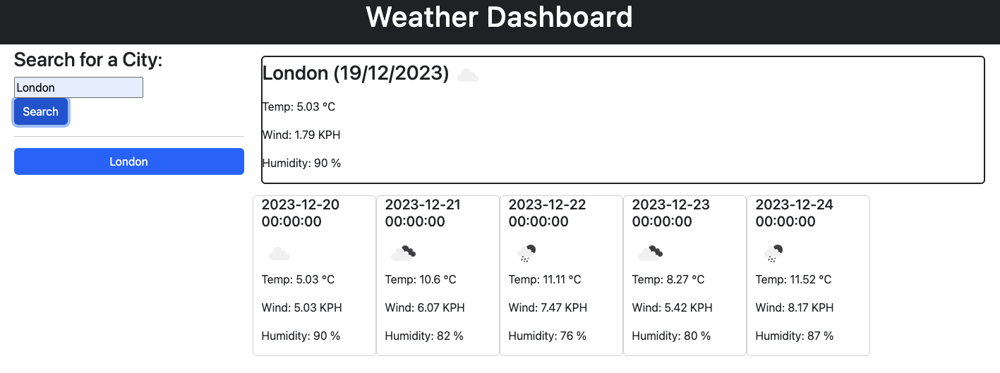

# Rupesh-weather-forecast
This is a Weather Dashboad application that allows users to search the 5 day of weather forecast.

## Description

This project was created to develop an application that allows users to view the weather forecast of 5 days, based on the following criteria:

- Upon opening the page, the user will be able to see the the search box.

- Once the user put the city name and click on search button, the page will populate the 5 day forecast of the weather.

- As the user put the different city, the user will get the required weather forecast of the city.

These app helps us to provide the 5 days forecast of the weather according to the city.
The main things I have learned from this project are how to use local storage, jQuery, Web API and Third party API.

[Link to my deployed web page](https://github.com/rrana5106/Rupesh-weather-forecast)

## Installation
N/A

## Usage
Below is a screenshot of the published webpage:

## Credits
N/A

## License
N/A
